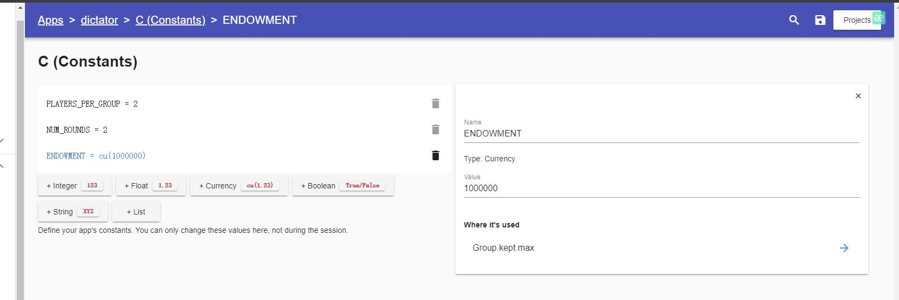

# Weekly reflection 1

## Question 1
on Beyond Computer Science and Economics Methodology 1 Behavioral Game Theory and Mechanism Design: Innovating Behavioral Game Theory Tools**

Analyze your experience with oTree, identifying pain points in behavioral game theory research. Review related literature and class discussions to understand experimental economics' goals. Propose a software solution that outperforms oTree in at least three aspects, enhancing strategic interaction studies. Highlight why these advancements are crucial. Submit a concise essay question answer (500 words max) with your analysis and proposals, backed by literature and class insights. Your innovative ideas can significantly contribute to experimental economics, addressing current limitations and paving the way for advanced research methodologies. 

In the analysis, you must provide at least one example of your personal experience in deploying the trust game using oTree, together with a screenshot.

### Answer1

I had a suffering time with the oTree platform at the beginning, especially when I was trying to download the platform with the Python package in my Windows operating system, and I met lots of strange error problems before I finally succeeded in operating an economic, behavioral game on that. As stated in the video (2021) provided in Ed, the advantage of its flexibility is found since the form of the website allows users to utilize any device that has a website. However, the pain point is also apparent, that the threshold of usage is still relatively high. As the video (2021) mentioned, even regardless of considering other languages like CSS and JavaScript, one has to spare a great deal of effort in learning Python skills to perform basic operations in three studios. 

One example from my personal experience would be, as the graph below shows, when I was trying to perform the trust game and the dictator game together by adding a constraint that the starting endowment of the dictator game was the exact amount that users left in the former trust game they played. By setting this constraint, I wish to create a continuous environment for the two games and better observe players' actions in the second game to see if they will make movements more biased toward rationality if some results in the first game change their minds. For example, one may be willing to offer the other player more endowments in the dictator game if the other player generously cooperated in the first game, which better shows bounded rationality. The problem occurred when I was trying to operate this idea on oTree studio, and due to the unfamiliar system and my poor coding skills, I finally failed to achieve this assumption.

*Figure 1-oTree data*

To solve the pain points, I propose to input the large language model that is deeply learned and familiar with the platform coding language into oTree. The article introducing a potential alternative to oTree, which was proposed by Aitharaju(2016), inspired me a lot. He mentioned Choice Flow, a platform that uses cloud-based data and automatically tracks user data and interaction data such as clicking time and behaviors that better help researchers manage and analyze. Instead of coding to design complex games, researchers only need to input storylines and discount strategies to imitate and observe participants' behaviors.  

*Figure 2-Choiceflow information*

Although we can currently try to use ChatGPT to help us generate some advice or basic coding to operate the platform, it also requires users to have a deep understanding of the platform and input correct phrases and requirements to fulfill their needs. However, inputting a deep learning AI that is familiar with the platform rules would create a different condition, that users only need to create their expectations, even without a coding background, can the AI help them generate an appropriate environment to run their experiments with outcomes. 
